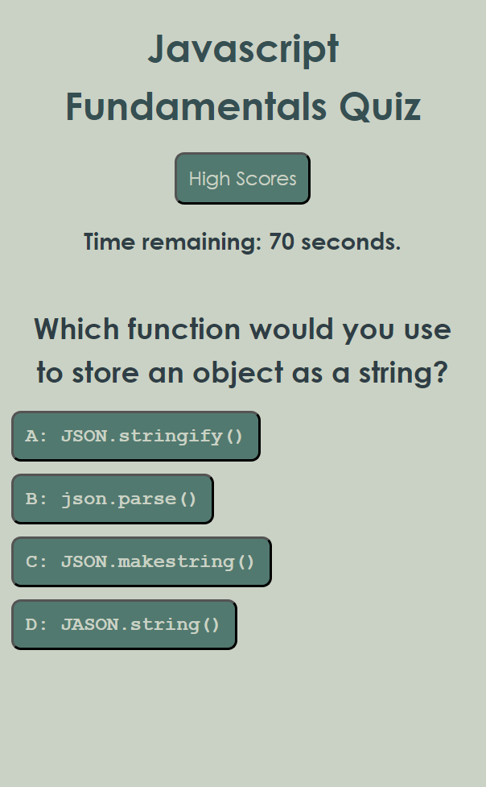

# 04 Web APIs: Code Quiz

## Your Task

At some point in your journey to become a full-stack web developer, you’ll likely be asked to complete a coding assessment&mdash;perhaps as part of an interview process. A typical coding assessment includes both multiple-choice questions and interactive coding challenges. 

To help familiarize you with these tests and allow you to use the skills covered in this module, this Challenge invites you to build a timed coding quiz with multiple-choice questions. This app will run in the browser and will feature dynamically updated HTML and CSS powered by JavaScript code that you write. It will have a clean, polished, and responsive user interface. 

This week’s coursework will equip you with all the skills you need to succeed in this assignment.

## User Story

```
AS A coding boot camp student
I WANT to take a timed quiz on JavaScript fundamentals that stores high scores
SO THAT I can gauge my progress compared to my peers
```

## Acceptance Criteria

```
GIVEN I am taking a code quiz
WHEN I click the start button
THEN a timer starts and I am presented with a question
WHEN I answer a question
THEN I am presented with another question
WHEN I answer a question incorrectly
THEN time is subtracted from the clock
WHEN all questions are answered or the timer reaches 0
THEN the game is over
WHEN the game is over
THEN I can save my initials and my score
```

## Example: 

A screenshot of the quiz while it is running: 



## Deployed Application: 

The application can be accessed at: https://shagomir.github.io/challenge_week_04_javascript_quiz/

## Developer Notes:

This is a web-first design for a quiz that will test basic knowledge of Javascript. There are ten questions, and the user is given 90 seconds to complete the quiz. 

The general design philosophy is to have event listeners attached to buttons that kick off various function trees to create the dynamic page. The page is divided into four main sections that are dynamically hidden or shown based on the current state of the quiz. 

Clicking on the start button will start the timer, which runs using a global interval. Several functions need to be able to end this, so this makes it useful to stop the timer while it is not needed. 

Questions are stored as an array of question objects on a separate script page, which is loaded first to ensure that it is available when the quiz starts. When entering the test, the questions in the array of objects for the questions are randomly shuffled to provide additional challenge. 

The question answer buttons are mapped to each result with a loop, which compares the answer to the ID of the button that was clicked to determine if it was correct or incorrect. Once this is recorded, the index for the quiz section is incremented and the next question is loaded. Since the operation of the quiz is event-based, this is a better solution than a loop.

For each correct answer, the player is awarded 5 points. If they get all of the questions correct, they will get bonus points equal to the number of seconds remaining when they answered the final question. If they answer the question incorrectly, 5 seconds will be removed from the timer. 

The high score screen is automatically shown after the quiz is complete. There is some logic to determine the score and if the player has finished the quiz, which is updated to the player object. If the conditions are met, the form will be shown, otherwise it is hidden.  

When the initials are stored they are forced to uppercase and trimmed to 3 characters, then the player object is pushed to the high score list, which is then stored in local memory. After this the player object is re-initiated with default values for another quiz session. 

Resetting the high scores requires deleting the local memory storage, as well as re-initializing the locally stored list as an array with no content. This duplicates the setting when the page is loaded for the first time in a new browser.

When creating the high score list, the list is first sorted highest to lowest, and then dynamic elements are created using Javascript corresponding to the entries in the stored player object array.

 The last item in the high score list gets some special formatting, so there is logic to add an additional class to this item. This gets applied to the header row if the high score list is empty. 

 Finally, we re-use the start button to start another quiz cycle at the bottom of the high score page. This ensures that the quiz runs the same each time and does not go off the rails, so to speak. 

 I did a quick evaluation of the memory usage of the quiz duing a cycle, and it appears that there are no execution loops, so this performs well and does not lead to instability regardless of the number of quiz iterations completed. 

